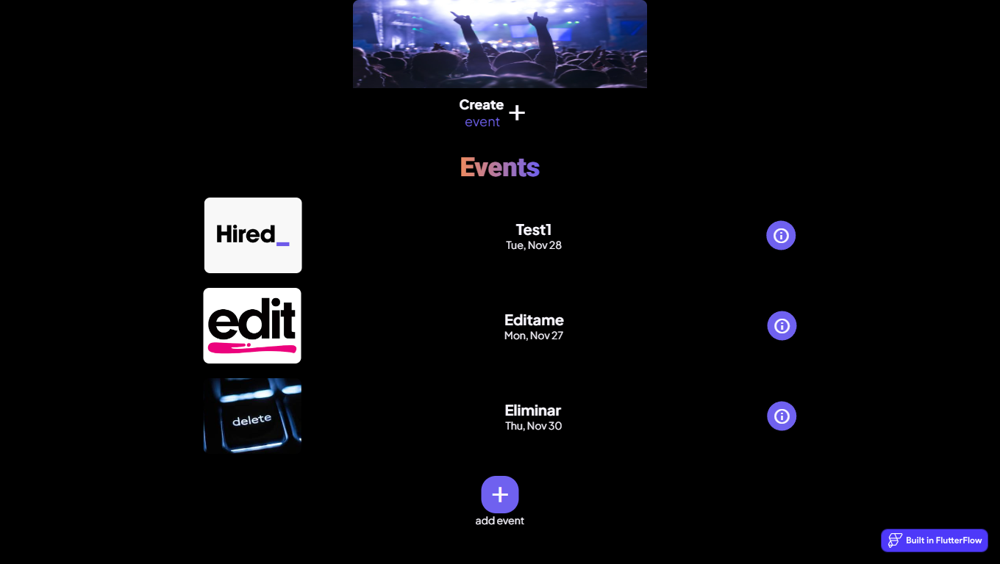

Project Title: QR-Enabled Event Manager with Firebase Integration

Description:

The QR-Enabled Event Manager is an application developed in FlutterFlow that streamlines event management, enabling users to efficiently register, edit, and delete events. The application integrates key features to facilitate event organization and participation, providing a smooth and user-friendly experience, backed by the power of Firebase.

Key Features:

Event Registration:

Users can create new events by providing detailed information such as name, date, location, and description.
Firebase is utilized to store and manage event data, ensuring efficient and scalable data management.
Event Editing:

Allows users to modify information for existing events, making it easy to update relevant details.
Firebase enables real-time synchronization of changes, ensuring a consistent user experience.
Event Deletion:

Offers the ability to delete events that are no longer relevant.
Firebase ensures secure data deletion, maintaining the integrity of stored information.
QR Code Scanning:

Integrates QR code scanning functionality, allowing users quick access to event information.
Firebase manages authentication and authorization, ensuring secure access to scanned data.
Responsive Design:

The application is designed to adapt to various screen sizes, providing a consistent experience on mobile devices and tablets.
Security and Privacy:

Implements security measures backed by Firebase to protect event information.
User and event data are securely stored in the cloud, following best practices for privacy.
Benefits:

Organizational Efficiency: Simplifies event management, backed by the efficiency of Firebase in data storage and retrieval.

Quick Access: QR code scanning streamlines the event registration process, enhancing the user experience and leveraging Firebase scalability.

User-Friendly Interface: The intuitive design facilitates navigation and interaction, supported by the reliability and speed of Firebase.

Next Steps:

Continuously improve the application with new features and performance enhancements.

Gather user feedback to make updates tailored to user needs.

The QR-Enabled Event Manager with Firebase is a comprehensive and secure tool for event administration, providing users with full control over their scheduled activities backed by the robustness and reliability of Firebase. Download the application now and simplify your experience in event management!

User
